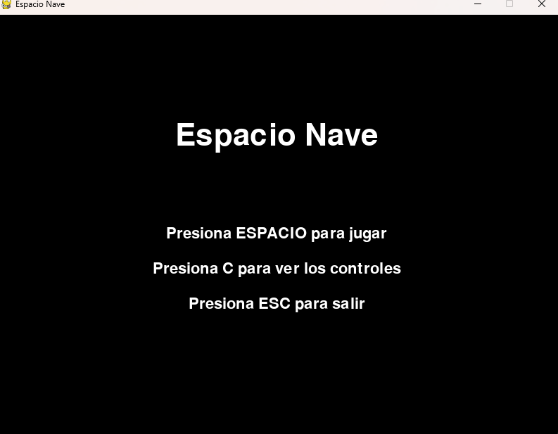
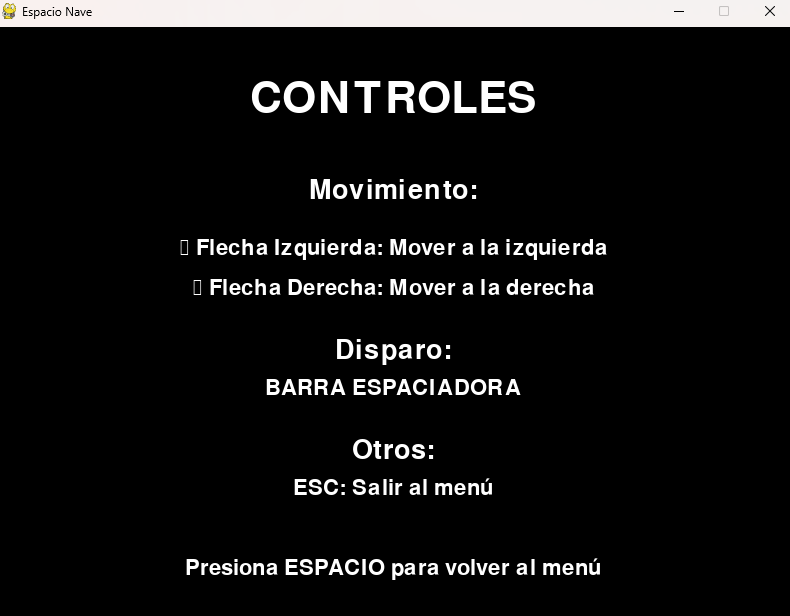
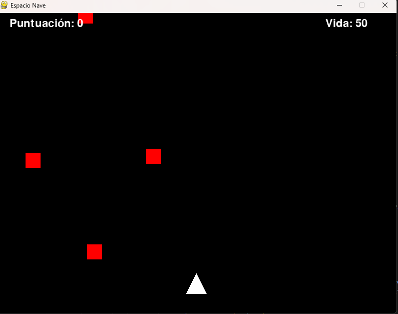

# Espacio Nave 🚀

Un juego espacial simple creado con PyGame donde controlas una nave espacial y debes sobrevivir a una lluvia de enemigos.

---

## Descripción

**Espacio Nave** es un juego de acción en 2D donde el jugador controla una nave espacial que debe enfrentarse a naves enemigas.  
El objetivo es sobrevivir el mayor tiempo posible mientras acumulas puntos destruyendo enemigos.



---

## Características

- ✅ Sistema de control intuitivo con las flechas del teclado.
- ✅ Disparos con la barra espaciadora.
- ✅ Sistema de puntuación.
- ✅ Barra de vida.
- ✅ Menú principal interactivo.
- ✅ Pantalla de controles.
- ✅ Pantalla de Game Over.
- ✅ Enemigos con movimientos aleatorios.
- ✅ Sistema de colisiones dinámico.

---

## Controles

### En el Menú Principal
- **ESPACIO**: Iniciar juego.
- **C**: Ver controles.
- **ESC**: Salir del juego.
  


### Durante el Juego
- **Flecha izquierda**: Mover la nave a la izquierda.
- **Flecha derecha**: Mover la nave a la derecha.
- **Barra espaciadora**: Disparar.
- **ESC**: Volver al menú principal.



---

## Requisitos

- Python 3.x
- PyGame

---

## Instalación

1. PyGame:

   ```bash
   pip install pygame
---

## Mecánicas del Juego
La nave del jugador se mueve horizontalmente en la parte inferior de la pantalla. Los enemigos aparecen en la parte superior y se mueven hacia abajo. Dispara a los enemigos usando la barra espaciadora. Cada enemigo destruido otorga 100 puntos. Colisionar con un enemigo reduce la vida en 10 puntos. El juego termina cuando la vida del jugador llega a 0.


---

## Estructura del Código


El juego está organizado en varias clases y funciones:

Clases

### Jugador: Maneja la nave del jugador.
### Enemigo: Controla las naves enemigas.
### Disparo: Gestiona los proyectiles.


## Funciones Principales

- mostrar_menu(): Muestra el menú principal.
- mostrar_controles(): Muestra la pantalla de controles.
- juego_principal(): Ejecuta el bucle principal del juego.
- mostrar_game_over(): Muestra la pantalla de fin de juego.
- detectar_colision(): Maneja la detección de colisiones.
- dibujar_texto(): Mostrar texto en pantalla.


